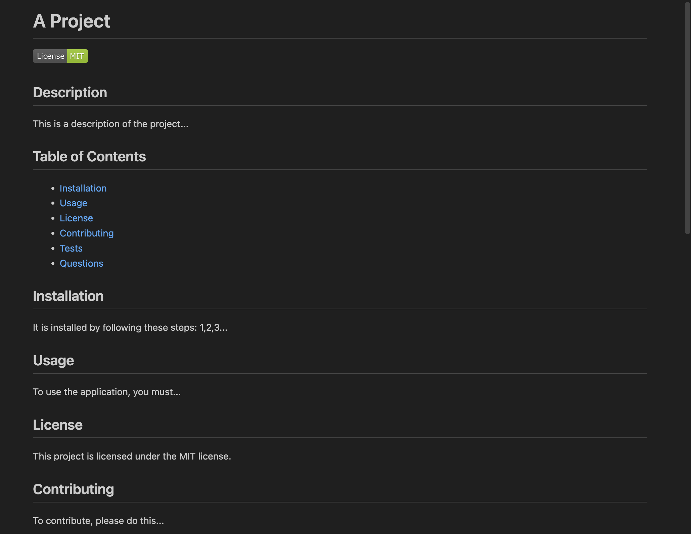

# README Generator

A command-line application designed to help developers quickly and easily generate a professional `README.md` file for their GitHub repositories. This tool uses the Inquirer package to prompt the user for project information, and then dynamically generates a complete README with all the necessary sections, including the title, description, installation instructions, usage information, license, contribution guidelines, and more.

## Table of Contents

- [Overview](#overview)
- [Features](#features)
- [Technologies Used](#technologies-used)
- [Concepts Covered](#concepts-covered)
- [Learning Objectives](#learning-objectives)
- [Future Improvements](#future-improvements)
- [Summary](#summary)

## Overview

The README Generator is a command-line tool that simplifies the creation of professional README files for new projects. By answering a series of prompts, users can provide information about their project, including the project title, description, installation instructions, and more. The tool supports a variety of open-source licenses and includes links to the user’s GitHub profile and email in the Questions section.

## Features

- **Project Title**: Prompts the user to input the title of their project, which will be displayed as the main header in the generated README.
- **Description**: Collects a detailed description of the project and includes it in the appropriate section.
- **License Badge**: Automatically adds a license badge to the README based on the user's choice from a list of popular licenses.
- **Installation Instructions**: Prompts the user to provide instructions on how to install the project.
- **Usage Information**: Allows the user to provide details on how the project is used.
- **Contribution Guidelines**: Prompts the user for contribution guidelines to help other developers contribute to the project.
- **Test Instructions**: Allows the user to include test instructions.
- **GitHub and Email Integration**: Automatically adds links to the user’s GitHub profile and email address in the Questions section.
- **Formatted README File**: Outputs a professional, cleanly formatted `README.md` file with all relevant sections.

## Technologies Used

- **Node.js**: Provides the runtime environment for executing the command-line tool.
- **Inquirer**: Used for prompting the user for input and gathering necessary project information.
- **File System (`fs`)**: Utilized to write the generated markdown content to a `README.md` file.

## Concepts Covered

- **Command-line Input**: Capturing user input from the terminal using Inquirer and dynamically generating content.
- **Markdown Rendering**: Creating markdown content with template literals to ensure the proper format of the generated README file.
- **License Handling**: Adding dynamic license badges and links based on user input.
- **File Writing with Node.js**: Writing the generated markdown content to a file using the built-in `fs` module.

## Learning Objectives

1. Learn how to create a command-line application in Node.js.
2. Understand how to use Inquirer to prompt users for input and handle responses.
3. Explore how to dynamically generate markdown content using template literals.
4. Gain experience in using the Node.js File System (`fs`) module to write data to files.

## Future Improvements

- **Template Customization**: Allow users to customize the layout and sections of the README beyond the default template.
- **Multiple License Support**: Provide users with the ability to select multiple licenses for their project.
- **Improved Formatting**: Add more advanced markdown formatting options like tables and code blocks.
- **Interactive UI**: Create a more user-friendly, interactive user interface for generating READMEs.
- **Readme Preview**: Provide a live preview of the generated README before saving it.

## Summary

The README Generator is a valuable tool for developers who want to quickly create professional README files for their GitHub projects. By automating the process of generating sections like the project title, description, installation, and license, the tool saves time and ensures that every project has a well-structured and informative README. With features like GitHub and email integration, it provides all the essentials needed for an open-source project README.
